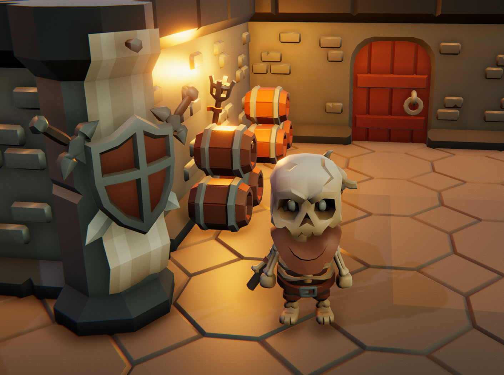

# Jett Swizzle and the Dungeon

A sample Unity project. This is an ongoing demo that will grow over time as I publish new tutorials and tips. Expect new systems, features, and refactors to land here alongside each video.

## About

This repository is a living playground. Rather than spinning up a fresh project for every tutorial, I'll keep building on top of *Jett Swizzle and the Dungeon* so viewers can follow the project's evolution end to end, from small mechanics samples to larger gameplay systems.

## Resources

This project uses art assets by [Kay Lousberg](https://kaylousberg.itch.io/).
